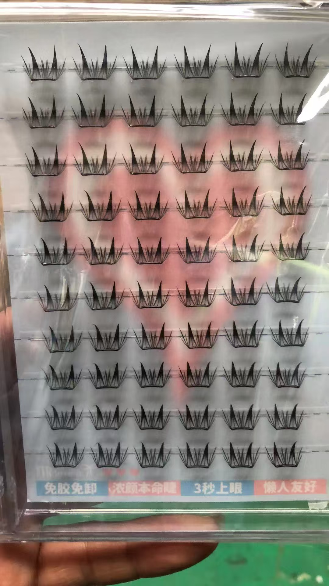
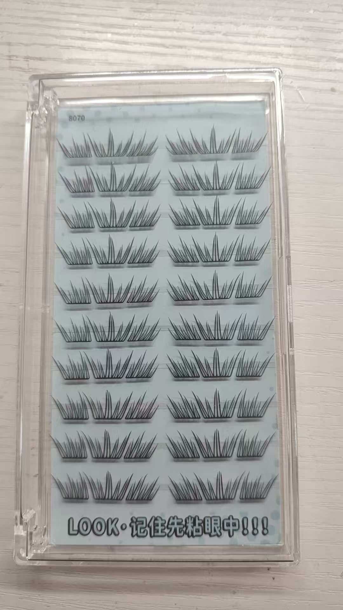

# 假睫毛独立站部署和使用指南

## 📁 项目文件结构

```
eyelash-website/
├── index.html              # 主页面（多语言支持）
├── styles.css              # 响应式样式（欧美流行风格）
├── script.js               # JavaScript功能（多语言切换）
├── sitemap.xml             # 网站地图（SEO）
├── robots.txt              # 搜索引擎爬虫规则
├── schema.json             # 结构化数据（Google Rich Results）
├── FREE_MARKETING_STRATEGY.md  # 完整推广策略
└── images/                 # 图片文件夹（需要创建）
    ├── hero-bg.jpg         # 首页背景图
    ├── product-placeholder.jpg  # 产品占位图
    ├── factory-placeholder.jpg  # 工厂图片
    ├── og-image.jpg        # 社交媒体分享图
    └── logo.png            # 网站Logo
```

## 🚀 快速部署步骤

### 方法1：使用GitHub Pages（推荐，完全免费）

1. **创建GitHub账号**
   - 访问：https://github.com
   - 注册免费账号

2. **创建新仓库**
   - 点击"New repository"
   - 仓库名：`eyelash-website`
   - 设置为Public
   - 点击"Create repository"

3. **上传文件**
   ```bash
   # 在项目文件夹中打开命令行
   cd C:\Users\Administrator\lobsterai\project\eyelash-website

   git init
   git add .
   git commit -m "Initial commit"
   git branch -M main
   git remote add origin https://github.com/你的用户名/eyelash-website.git
   git push -u origin main
   ```

4. **启用GitHub Pages**
   - 进入仓库Settings
   - 找到"Pages"
   - Source选择"main"分支
   - 点击Save
   - 网站将在 `https://你的用户名.github.io/eyelash-website/` 上线

5. **绑定自定义域名（可选）**
   - 购买域名（如：falseeyelashfactory.com）
   - 在域名DNS设置中添加CNAME记录指向：`你的用户名.github.io`
   - 在GitHub Pages设置中输入自定义域名

### 方法2：使用Netlify（推荐，免费+自动部署）

1. **访问Netlify**
   - https://www.netlify.com
   - 使用GitHub账号登录

2. **部署网站**
   - 点击"Add new site" → "Import an existing project"
   - 选择GitHub仓库
   - 点击"Deploy site"
   - 自动生成网址：`https://随机名称.netlify.app`

3. **自定义域名**
   - 在Site settings中设置自定义域名
   - Netlify提供免费SSL证书

### 方法3：使用Vercel（免费+快速）

1. **访问Vercel**
   - https://vercel.com
   - 使用GitHub账号登录

2. **导入项目**
   - 点击"New Project"
   - 选择GitHub仓库
   - 点击"Deploy"
   - 自动生成网址：`https://项目名.vercel.app`

## 📸 添加产品图片

### 1. 查找桌面newai文件夹中的图片

由于我无法直接访问您的桌面文件夹，请您手动操作：

1. **找到图片文件夹**
   - 打开桌面上的"newai"文件夹
   - 查看所有假睫毛图片

2. **复制图片到项目**
   ```
   将图片复制到：
   C:\Users\Administrator\lobsterai\project\eyelash-website\images\
   ```

3. **图片命名建议**
   ```
   product-1.jpg  (3D貂毛睫毛)
   product-2.jpg  (浓密睫毛)
   product-3.jpg  (自然睫毛)
   product-4.jpg  (磁性睫毛)
   product-5.jpg  (更多产品...)
   hero-bg.jpg    (首页背景 - 选择最吸引人的图片)
   factory.jpg    (工厂照片)
   logo.png       (Logo图片)
   ```

### 2. 优化图片（重要！）

**在线图片压缩工具（免费）：**
- TinyPNG: https://tinypng.com
- Compressor.io: https://compressor.io
- Squoosh: https://squoosh.app

**目标：**
- 产品图片：< 200KB
- 背景图片：< 500KB
- Logo：< 50KB

### 3. 更新HTML中的图片路径

编辑 `index.html`，将占位图片替换为实际图片：

```html
<!-- 示例：将 product-placeholder.jpg 替换为实际图片 -->


```

## 🔧 网站配置

### 1. 更新域名

在以下文件中将 `https://yourdomain.com` 替换为您的实际域名：

- `sitemap.xml`
- `schema.json`
- `robots.txt`

### 2. 添加Google Analytics（可选）

在 `index.html` 的 `</head>` 标签前添加：

```html
<!-- Google Analytics -->
<script async src="https://www.googletagmanager.com/gtag/js?id=G-XXXXXXXXXX"></script>
<script>
  window.dataLayer = window.dataLayer || [];
  function gtag(){dataLayer.push(arguments);}
  gtag('js', new Date());
  gtag('config', 'G-XXXXXXXXXX');
</script>
```

### 3. 添加Facebook Pixel（可选）

在 `index.html` 的 `</head>` 标签前添加：

```html
<!-- Facebook Pixel -->
<script>
  !function(f,b,e,v,n,t,s)
  {if(f.fbq)return;n=f.fbq=function(){n.callMethod?
  n.callMethod.apply(n,arguments):n.queue.push(arguments)};
  if(!f._fbq)f._fbq=n;n.push=n;n.loaded=!0;n.version='2.0';
  n.queue=[];t=b.createElement(e);t.async=!0;
  t.src=v;s=b.getElementsByTagName(e)[0];
  s.parentNode.insertBefore(t,s)}(window, document,'script',
  'https://connect.facebook.net/en_US/fbevents.js');
  fbq('init', 'YOUR_PIXEL_ID');
  fbq('track', 'PageView');
</script>
```

## 📊 SEO优化清单

### 立即执行：

- [x] ✅ 创建sitemap.xml
- [x] ✅ 创建robots.txt
- [x] ✅ 添加Schema.org结构化数据
- [x] ✅ 优化Meta标签
- [x] ✅ 多语言支持
- [ ] ⏳ 添加实际产品图片
- [ ] ⏳ 压缩图片
- [ ] ⏳ 注册Google Search Console
- [ ] ⏳ 提交sitemap到Google
- [ ] ⏳ 获取SSL证书（HTTPS）

### 第一周：

- [ ] 创建Google My Business
- [ ] 注册社交媒体账号
- [ ] 撰写3篇博客文章
- [ ] 注册5个B2B平台
- [ ] 设置Google Analytics

### 第一个月：

- [ ] 发布10篇博客文章
- [ ] 创建YouTube频道并上传5个视频
- [ ] 社交媒体每天发帖
- [ ] 联系20个微影响者
- [ ] 获得前100个邮件订阅者

## 🎨 自定义网站

### 修改颜色主题

编辑 `styles.css` 中的CSS变量：

```css
:root {
    --primary-color: #d4af37;      /* 主色调（金色）*/
    --secondary-color: #2c2c2c;    /* 次要色（深灰）*/
    --accent-color: #ff69b4;       /* 强调色（粉色）*/
}
```

### 添加更多产品

在 `index.html` 的产品区域复制粘贴产品卡片：

```html
<div class="product-card">
    <div class="product-image">
        
        <div class="product-badge" data-i18n="badgeNew">New</div>
    </div>
    <div class="product-info">
        <h3>产品名称</h3>
        <p>产品描述</p>
        <div class="product-price">
            <span class="price" data-i18n="priceContact">Contact for Price</span>
        </div>
    </div>
</div>
```

### 添加更多语言

在 `script.js` 的 `translations` 对象中添加新语言：

```javascript
translations.nl = {  // 荷兰语
    siteName: "Valse Wimpers Wereldfabriek",
    navHome: "Home",
    // ... 更多翻译
};
```

然后在HTML的语言选择器中添加：

```html
<option value="nl">Nederlands</option>
```

## 🌐 域名购买建议

### 推荐域名注册商：

1. **Namecheap** (https://www.namecheap.com)
   - 价格实惠
   - 免费隐私保护
   - 首年约$8-12

2. **Google Domains** (https://domains.google)
   - 简单易用
   - 免费隐私保护
   - 约$12/年

3. **Cloudflare** (https://www.cloudflare.com/products/registrar/)
   - 成本价
   - 免费CDN和SSL
   - 约$8-10/年

### 域名建议：

- falseeyelashfactory.com
- eyelashworldfactory.com
- premiumlashfactory.com
- globaleyelashsupply.com
- lashfactorydirect.com

## 📱 测试网站

### 在不同设备上测试：

1. **桌面浏览器**
   - Chrome
   - Firefox
   - Safari
   - Edge

2. **移动设备**
   - iPhone
   - Android手机
   - iPad
   - Android平板

3. **在线测试工具**
   - Google Mobile-Friendly Test: https://search.google.com/test/mobile-friendly
   - PageSpeed Insights: https://pagespeed.web.dev
   - GTmetrix: https://gtmetrix.com

## 🔒 安全性

### SSL证书（HTTPS）

**免费SSL选项：**

1. **Let's Encrypt**
   - 完全免费
   - 自动续期
   - 大多数托管平台自动提供

2. **Cloudflare**
   - 免费SSL
   - 免费CDN
   - DDoS保护

### 备份

定期备份网站文件：
- 使用Git版本控制
- 下载完整网站文件
- 导出数据库（如果使用）

## 📞 技术支持

如果遇到问题：

1. **查看文档**
   - GitHub Pages: https://docs.github.com/pages
   - Netlify: https://docs.netlify.com
   - Vercel: https://vercel.com/docs

2. **社区支持**
   - Stack Overflow
   - GitHub Issues
   - Reddit (r/webdev)

3. **联系我**
   - Email: oilsei65799009@gmail.com
   - Telegram: @crypto_x_YU

## ✅ 上线前检查清单

- [ ] 所有图片已添加并优化
- [ ] 联系信息正确
- [ ] 所有链接正常工作
- [ ] 多语言切换正常
- [ ] 移动端显示正常
- [ ] 表单提交正常
- [ ] 已添加Google Analytics
- [ ] 已获取SSL证书（HTTPS）
- [ ] 已提交sitemap到Google
- [ ] 已创建社交媒体账号
- [ ] 已准备好推广内容

## 🎉 恭喜！

您的假睫毛独立站已经准备就绪！

接下来请按照 `FREE_MARKETING_STRATEGY.md` 中的策略开始推广。

祝您生意兴隆！💰
